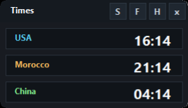

# World Time Widget for Windows

A compact Windows desktop widget for tracking multiple time zones at a glance.

It starts with USA Eastern, USA PST, Morocco, and China clocks, and includes settings so you can add any country, city, or time zone supported by Windows.



## Features

- Compact always-on-top clock widget
- Full view with seconds, date, city, and UTC offset
- Add, remove, rename, and reorder clocks
- Search Windows time zones from the settings window
- Hide to the Windows tray and restore with a double-click
- Starts automatically with Windows
- No cloud account, tracking, or paid subscription

## Install

Download or clone this repository, then run:

```powershell
powershell -ExecutionPolicy Bypass -File ".\Install-WorldTimeWidget.ps1"
```

The installer builds the widget locally, places it in `%LOCALAPPDATA%\CodexWorldTimeWidget`, creates Desktop and Start Menu shortcuts, creates a Startup shortcut, and launches it.

## Use

- `S`: open settings
- `F`: switch from compact view to full view
- `C`: switch from full view back to compact view
- `H`: hide to the Windows tray
- `x`: exit completely

Double-click the tray icon, or right-click it and choose `Show`, to bring the widget back.

## Add Any Country Or Time Zone

Open settings with `S`, then:

1. Click `Add`.
2. Set the display name, such as `USA California`, `UAE`, or `London`.
3. Set the city/place label.
4. Search the time zone box and choose the closest Windows time zone.
5. Click `Save`.

The clock list is saved locally at `%LOCALAPPDATA%\CodexWorldTimeWidget\clocks.tsv`.

## Included Windows Time Zones

- `Eastern Standard Time` for New York / Eastern Time
- `Pacific Standard Time` for Los Angeles / PST and PDT
- `Morocco Standard Time` for Casablanca
- `China Standard Time` for Beijing

## Uninstall

```powershell
powershell -ExecutionPolicy Bypass -File ".\Uninstall-WorldTimeWidget.ps1"
```

## Privacy

World Time Widget stores only local display settings and your chosen time-zone list on your own computer. It does not collect analytics, send data to a server, or require an account.

## License

MIT
